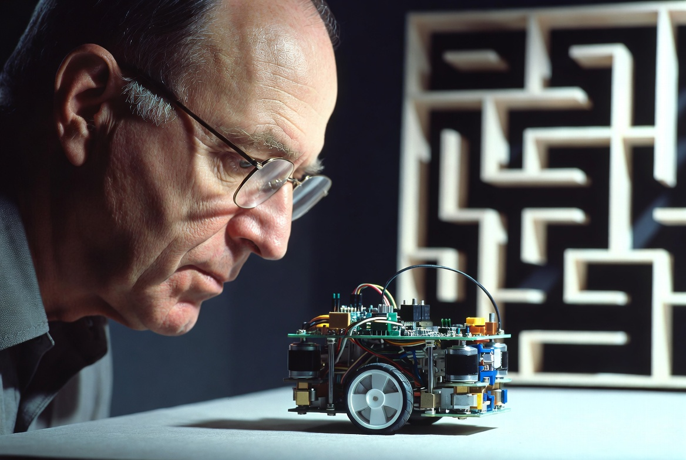

# Level 4: Teseo

En esta práctica vas a **diseñar y programar un agente autónomo** capaz de navegar un laberinto en el menor tiempo posible.

## Contexto: el ratón que aprendió a pensar



**Bell Labs, 1950.** Claude Shannon acababa de publicar *A Mathematical Theory of Communication*, el paper que fundó la teoría de la información. Pero ese año también tenía otro proyecto entre manos, más pequeño, más curioso.

Construyó un ratón de madera con un imán en la base y lo llamó **Theseus**.

Theseus se movía sobre un laberinto de 25 celdas. Debajo del tablero, un sistema de 75 relés electromagnéticos controlaba su recorrido. La primera vez que lo soltaban, el ratón exploraba el laberinto por ensayo y error. Pero una vez que encontraba la salida, memorizaba el camino. En la segunda corrida, lo recorría sin un solo error.

Shannon lo presentó en conferencias y en televisión. Lo llamó "un ejemplo de comportamiento adaptativo en máquinas". Era, en esencia, uno de los primeros dispositivos de inteligencia artificial de la historia.

Décadas después, el mundo de la robótica convirtió esa idea en una competencia oficial: **Micromouse**, organizada por el IEEE desde 1977. Robots reales navegan laberintos reales. Los mejores lo hacen en segundos.

**Tu misión**: construir el sucesor digital de Theseus, y competir contra los demás grupos por el mejor tiempo.

El laberinto ya está generado. La física, los sensores y el rendering ya funcionan. Lo que falta es lo único que importa: el algoritmo que hace que el ratón **piense**.

## El simulador

Para compilar el proyecto, instala primero las dependencias:

```bash
vcpkg install raylib box2d
```

Ejecuta el programa con:

```bash
teseo --gen 0         # laberinto generado con semilla 0
teseo --file abc.maze # laberinto cargado desde archivo
```

Puedes descargar laberintos reales de competencia en estos sitios:

- [micromouseonline/mazefiles](https://github.com/micromouseonline/mazefiles)
- [tcp4me.com - Micromouse Mazes](https://www.tcp4me.com/mmr/mazes/)

Presiona `[R]` para iniciar la primera corrida.

El laberinto sigue el estándar **IEEE Micromouse de 16x16 celdas** (18 cm cada una). El ratón arranca en la esquina suroeste `(0, 0)`, orientado al norte. El objetivo es el cuadrado central de **2x2 celdas**.

Dispones de **5 corridas** y **300 segundos** de tiempo total. La mejor marca es la que cuenta.

El tiempo de cada corrida se cuenta desde que el ratón **abandona la celda inicial** hasta que **llega a cualquiera de las cuatro celdas del destino**. Al terminar una corrida, el ratón debe **volver al origen** para poder iniciar la siguiente.

## El movimiento

El ratón se controla con la función:

```cpp
SetMouseSetpoint(sim, distance, rotation);
```

- `distance`: cuántos metros avanzar hacia adelante (positivo = adelante).
- `rotation`: cuánto girar respecto a la orientación actual, en radianes (positivo = izquierda, negativo = derecha). Puedes usar las constantes `TURN_CCW`, `TURN_CW` y `TURN_REVERSE`.

⚠️ **Importante**: el simulador introduce error de odometría. No asumas que el ratón termina exactamente donde le pediste.

## Los sensores

Los sensores se leen a través de:

```cpp
const SimState *s = GetSimState(sim);
```

### Infrarrojos

El ratón cuenta con **5 sensores de distancia** (metros) que apuntan en distintas direcciones:

| Constante | Dirección |
| --------- | --------- |
| `IR_SENSOR_LEFT` | 90° izquierda |
| `IR_SENSOR_FRONT_LEFT` | 45° izquierda |
| `IR_SENSOR_FRONT` | frente |
| `IR_SENSOR_FRONT_RIGHT` | 45° derecha |
| `IR_SENSOR_RIGHT` | 90° derecha |

```cpp
s->ir_sensors[IR_SENSOR_FRONT]   // distancia al frente (m)
s->ir_sensors[IR_SENSOR_LEFT]    // distancia a la izquierda (m)
// ...
```

El alcance máximo es **1 m**. Si no hay pared en rango, el sensor devuelve **1 m**.

### IMU

La **IMU** (Inertial Measurement Unit) mide el movimiento propio del ratón.

```cpp
s->mouse_accelerometer   // Vector2 (m/s²): x=adelante, y=izquierda (CCW+)
s->mouse_gyroscope       // float (rad/s, CCW+): velocidad angular
```

### Setpoint

El **setpoint** es el objetivo de movimiento que le pediste al controlador con `SetMouseSetpoint(...)`. Estos campos indican cuánto falta para completar ese comando.

```cpp
s->setpoint_distance_remaining   // float (m): distancia restante (positivo = falta avanzar)
s->setpoint_rotation_remaining   // float (rad, CCW+): rotación restante
```

Puedes cambiar el setpoint en todo momento.

## Tu misión

Implementa tu propio agente en una carpeta nueva dentro de `src/`. Puedes copiar `src/starter_mouse/` como punto de partida.

### API del agente

Tu agente debe implementar una estructura `MouseDescriptor` con cuatro callbacks:

```cpp
struct MouseDescriptor {
    const char *name;
    void *(*create)();                          // inicialización
    void  (*destroy)(void *userdata);           // liberación de memoria
    void  (*update)(void *userdata, Sim *sim);  // lógica principal, llamada cada frame
    void  (*reset)(void *userdata, Sim *sim);   // llamado en la primera corrida y cuando se resetea el ratón
};
```

Dentro de `update`, puedes usar las siguientes funciones:

```cpp
const SimState *GetSimState(sim);          // sensores, setpoint y estado de la corrida
void SetMouseSetpoint(sim, distance, rotation); // ver "El movimiento"

float AngleDiff(float source, float target);                // diferencia angular en [-π, π]
Vector2 Vector2FromAngle(float angle, float length = 1.0f); // vector a partir de un ángulo
Cell PositionToCell(Vector2 position);                      // posición → celda del laberinto

void PaintCell(sim, cell, color);   // COLOR_CELL_VISITED, COLOR_CELL_RED/GREEN/BLUE
uint32_t GetCellColor(sim, cell);
void ResetCellColors(sim);
```

No puedes acceder a los campos internos de `sim` ni a las otras funciones del simulador.

### Cómo registrar tu agente

1. Copia `src/starter_mouse/` a `src/tu_equipo/`.
2. Renombra los archivos, la struct interna y la variable `MouseDescriptor`.
3. Agrega tu `.cpp` a `SOURCES` en `CMakeLists.txt`.
4. En `src/main.cpp`, incluye tu header y pasa tu descriptor a `CreateMouse()`.

### Estrategias posibles

El **starter mouse** usa un seguidor de pared derecha: es fácil de entender, pero puede quedar en un bucle infinito si el laberinto tiene ciclos, y está lejos de ser óptimo.

Algunas ideas mejores:

- **Flood Fill**: asigna a cada celda una distancia al objetivo y avanza siempre hacia el valor menor. Es el algoritmo base en competencias reales. Puede actualizarse online a medida que el ratón descubre paredes.
- **Dead-end filling**: elimina callejones del mapa antes de trazar la ruta.
- **Dijkstra / A\***: búsqueda de camino óptimo sobre el mapa conocido.
- **Estrategia multi-corrida**: en las primeras corridas explora y construye un mapa; en las últimas, ejecuta la ruta óptima sin detenerse a explorar.

## Entrega

Debes entregar:

- El código de tu agente.
- El archivo `ENTREGA.md` **completo** con la siguiente información:
  - Nombre del equipo y del ratón.
  - Descripción del algoritmo implementado.
  - Mejor tiempo logrado (indica la semilla del laberinto o el archivo usado).
  - Complejidad temporal y espacial de tu algoritmo.
  - Dificultades encontradas y cómo las resolviste.
  - Reflexión: ¿qué limitaciones tiene tu solución? ¿Qué mejorarías?

## Recomendaciones

- Logra que tu ratón sea robusto al **error odométrico**. Para ello la información de los sensores IR y del giróscopo te será muy útil.
- Empieza con el seguidor de pared y asegúrate de que funciona correctamente antes de intentar algo más complejo.
- Usa `PaintCell` para visualizar el estado interno de tu algoritmo mientras depuras.
- Prueba con varios valores de `--gen` y con archivos cargados por `--file`: un buen algoritmo debe funcionar en cualquier laberinto, especialmente en los de competencias.
- Usa Git y haz commits con frecuencia.
- **No modifiques** el motor ni la UI del simulador.

## Bonus points 🚀

- Optimiza la trayectoria para **minimizar giros**: recorrer varias celdas seguidas en línea recta suele ser mucho más rápido.
- Optimiza los giros.
- Implementa recorridos en **diagonal sin giro** cuando tu estrategia lo permita.

## Referencias

- [The Fastest Maze-Solving Competition On Earth](https://www.youtube.com/watch?v=ZMQbHMgK2rw)
- [Claude Shannon — Theseus, the maze-solving mouse (film, 1952)](https://www.youtube.com/watch?v=_9_AEVQ_p74)
